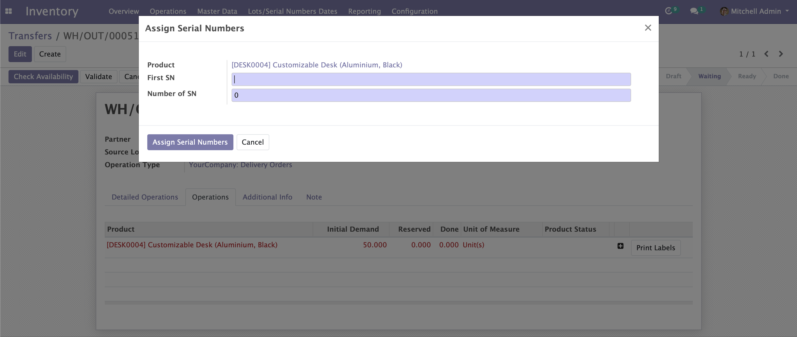

    <a href="https://www.odoo.com/documentation/12.0/index.html">
        </img>
    </a>
    <a href="http://www.alliantum.com">
        </img>
    </a>
    <a href="http://www.gnu.org/licenses/agpl-3.0-standalone.html">
        </img>
    </a>

    
    

        <h1>Serials</h1>
        Automatic generation of Serial Numbers on transfers
        

    

## Usage

Install this add-on and it will be automatically ready to use.

- You will now be able to automatically generate serial numbers on the transfers
    

        
    

## Contributors

- [Alliantum](http://www.alliantum.com)

## Disclaimer

The following source files were copied from [Odoo's GitHub repository](https://github.com/odoo/odoo) and they were not modified,
thus maintaining the original _license_, which can be found [here](https://github.com/odoo/odoo/blob/1d675780c2f0f7af110be7d7fc7ccfb2bca99022/LICENSE).

- [wizards/stock_assign_serial_numbers.py](https://github.com/odoo/odoo/blob/1d675780c2f0f7af110be7d7fc7ccfb2bca99022/addons/stock/wizard/stock_assign_serial_numbers.py)
- [wizards/stock_assign_serial_views.xml](https://github.com/odoo/odoo/blob/1d675780c2f0f7af110be7d7fc7ccfb2bca99022/addons/stock/wizard/stock_assign_serial_views.xml)
